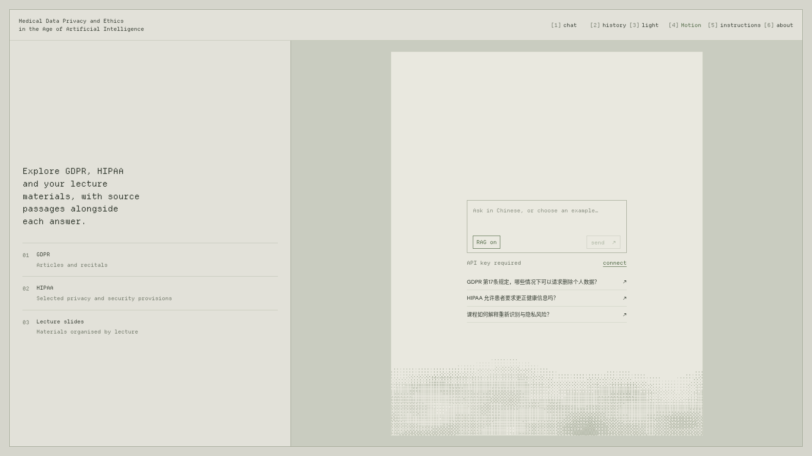

# Course RAG

Ask questions in Chinese about the GDPR, selected HIPAA regulations, and your lecture slides. Course RAG answers with numbered citations and displays the matching English passage or original slide page beside each answer.

The app includes a desktop browser interface, a command-line client, and an HTTP API. You can ask follow-up questions, quote a source passage, switch retrieval on or off, and optionally listen to answers using local speech synthesis.



## How it works

With **RAG on**, the app retrieves 50 candidate passages, reranks them to five, and sends those passages to DeepSeek to generate an answer. Follow-up questions use the last five conversation turns. Each answer keeps its own citations.

With **RAG off**, DeepSeek answers from the question and recent conversation without retrieving sources. A passage you explicitly quote is still included in your question.

PDF parsing, image descriptions, embeddings, reranking, vector storage, and speech synthesis run locally. Answer generation and follow-up rewriting use the hosted DeepSeek API, which receives the question, recent history, and retrieved or quoted text. Browser conversations stay in the current tab's session storage; the server does not save conversations or log questions.

## Requirements

- Linux with an NVIDIA GPU. The supplied model configuration targets an **RTX PRO 6000 Blackwell with 96 GB VRAM**; other hardware may require changes to the model launch settings.
- Python **3.10.12** and **uv**.
- Docker, available to your user account, for Qdrant.
- Node.js **22.12+** and npm to build or develop the frontend.
- DeepSeek API credentials and lecture PDFs named with unique lecture numbers, such as `Lecture 6.pdf`.

For a fresh checkout, follow the [installation guide](docs/setup.md). It covers dependencies, keys, model downloads, and the first corpus build. Model weights, lecture PDFs, and generated indexes are not included in Git.

## Start the app

After installation and the first corpus build, run these commands from the repository root:

```bash
source .venv/bin/activate
python scripts/services.py start serving
python scripts/services.py status all
curl --silent http://127.0.0.1:8000/health
```

Model startup can take several minutes. Check that the health response contains `"ready": true`; HTTP 200 alone does not mean the retrieval services are ready. The commands and URL above use the default ports.

Open [http://127.0.0.1:8000/](http://127.0.0.1:8000/), click **connect**, and enter `API_KEY` from your `.env` file. This is the local application key, separate from your DeepSeek credential. Reconnect after reloading the page because the browser keeps the key only in memory.

For a remote GPU host, forward port 8000 from your computer:

```bash
ssh -N -L 8000:127.0.0.1:8000 user@gpu-host
```

Then open the same local URL. The browser layout requires at least **1120 × 740** pixels.

## Use the app

- Ask a question, then click a numbered citation to read its source. Slide citations show the original PDF page.
- Select text in a legal passage to ask a follow-up about that selection.
- Use **RAG on / RAG off** in the question box to choose how the next message is answered.
- Open **history** to revisit or delete conversations in the current browser tab.
- Use the theme and motion controls to adjust the display.
- With the [optional speech service](docs/speech.md) running, click an answer's speaker button to listen. Select part of an answer to hear only that passage.

Cancelling an answer or speech request stops the browser waiting; computation already running on the backend may finish.

For terminal use:

```bash
python -m api.ask "GDPR 第17条规定，在什么情况下可以要求删除个人数据？"
python -m api.ask --json "HIPAA 允许患者要求更正健康信息吗？"
python -m api.chat
```

The chat client supports `/clear` and `/exit`, and keeps the last five turns in memory.

## Update the course materials

Add or replace PDFs in `data/raw/slides/`, then run:

```bash
python scripts/build.py
```

The build pauses this project's API and GPU services while processing the documents, reuses cached work where possible, and restarts serving when it succeeds. See [corpus maintenance](docs/operations.md#update-the-corpus) for removing PDFs, inspecting index changes, and troubleshooting ingestion.

To stop the app:

```bash
python scripts/services.py stop serving
# Also stop optional services such as speech:
python scripts/services.py stop all
```

Model files, document caches, and the index remain on disk.

## Documentation

- [Installation](docs/setup.md): environments, configuration, model downloads, and first build.
- [Operations](docs/operations.md): services, corpus updates, settings, and troubleshooting.
- [HTTP API](docs/api.md): authentication, requests, responses, and citations.
- [Development and evaluation](docs/development.md): frontend development, tests, and retrieval metrics.
- [Local speech](docs/speech.md): installation, playback, and performance measurement.
